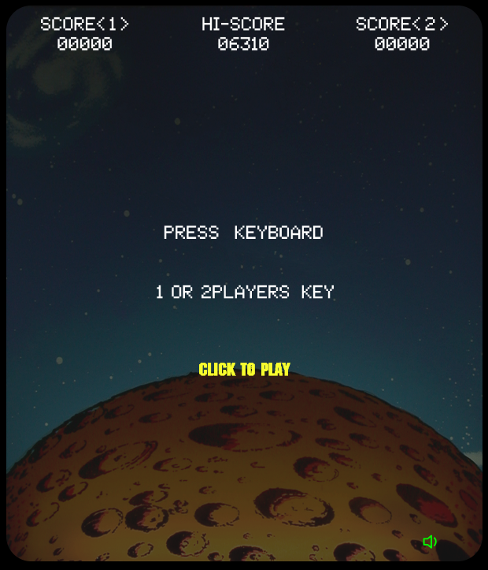

# Space Invador in P5Js

This is a tentative to reproduce Space Invaders Arcade Game.

I was inspired by the [Coding Train Challenge](https://thecodingtrain.com/CodingChallenges/005-space-invaders-p5.htm) "Space Invaders" of Daniel Shiffman for the basic design.

Some ideas come from Daniel Kaye "[Classic Style Space Invaders](https://editor.p5js.org/danno484/sketches/zzO5nmnEg)" who also contribute to the Coding Train Challenge about moving the alien from the frameCount of P5 modulo and timer usage for animating the explosions very great idea :)

And I took the original sprites designs of Space Invader Arcade game from the [Computer Archeology](http://www.computerarcheology.com/Arcade/SpaceInvaders/Code.html).

The following [YouTube video](https://www.youtube.com/watch?v=MU4psw3ccUI) was also very usefull in order to have a global view of how the game was working and [this one](https://www.youtube.com/watch?v=1tHpKF1kroU) in order to have an overview when 2 players mode is started.

Great part of the development:

Sprites that are bit arrays and not images ... the old fashion way in order to be the closest to the original!
Shield collision with shots and lasers which is done per pixel and the shield damaging was quite challenging
Laser an Shot collision
The overall result of the game

A playable version of the game is available [here](https://editor.p5js.org/stephane.roncin/full/1SqybgJe6)

